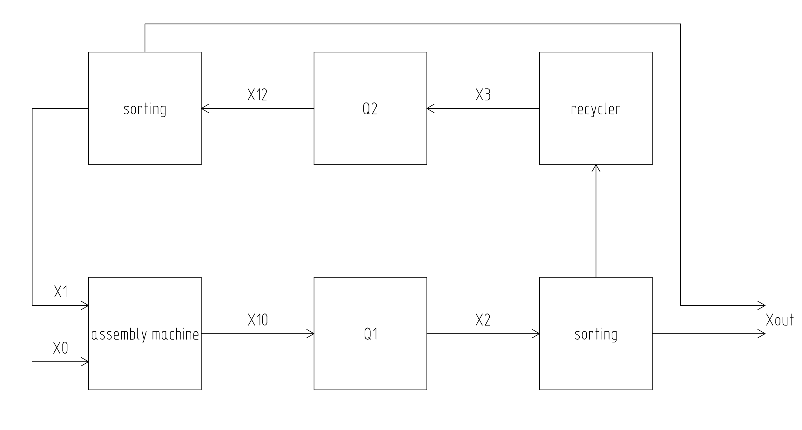
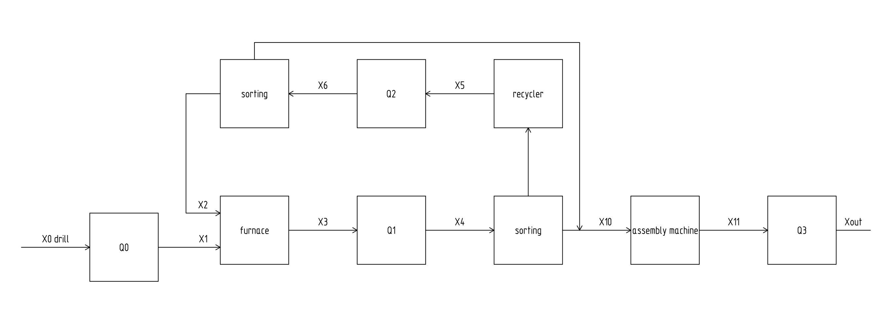

# factorio-quality

The scheme_1 class:

The scheme_2 class:

Q1, Q2 - blocks for calculating modules. Multiplies the quality/productivity matrix by the input data.

The calculation of x0,x1...south is in the **scheme_1** class
