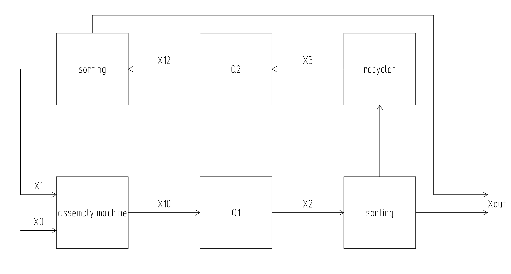

# factorio-quality

Q1, Q2 - blocks for calculating modules. Multiplies the quality/productivity matrix by the input data.

Calculation of X0,X1...Xout:

https://github.com/flameSla/factorio-quality/blob/main/quality.py#L164